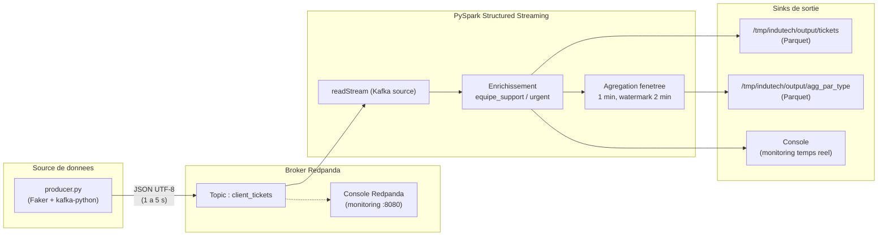

# Projet 9 — InduTech : POC de gestion de tickets en temps réel

POC d'un pipeline de streaming pour l'analyse en temps réel des tickets clients
d'InduTech. Les tickets sont générés par un producteur Python, envoyés dans un
broker **Redpanda** (compatible Kafka), puis consommés et enrichis par un job
**PySpark Structured Streaming** qui écrit les résultats en **Parquet**.

---

## Architecture du pipeline



### Schema d'un ticket

| Champ        | Type      | Description                                             |
|--------------|-----------|---------------------------------------------------------|
| `ticket_id`  | String    | UUID unique du ticket                                   |
| `client_id`  | Int       | Identifiant client (1000–9999)                          |
| `created_at` | ISO8601   | Timestamp UTC de creation                               |
| `demande`    | String    | Texte de la demande (genere via Faker `fr_FR`)          |
| `type`       | String    | `technique` \| `facturation` \| `livraison` \| `autre`  |
| `priorite`   | String    | `basse` \| `moyenne` \| `haute`                         |

---

## Structure du projet

```
DE_Projet_9/
├── docker-compose.yml        # Orchestration Redpanda + Console
├── requierements.txt         # Dependances Python communes
├── producer/
│   ├── Dockerfile
│   └── producer.py           # Generateur de tickets
├── spark/
│   ├── Dockerfile
│   └── pyspark_consumer.py   # Job Structured Streaming
└── redpanda/
    └── Dockerfile
```

---

## Prerequis

- Docker & Docker Compose
- (Optionnel, pour execution locale hors Docker) Python 3.9+ et Java 11+

---

## Demarrage rapide

### 1. Lancer le broker Redpanda

```bash
docker compose up -d redpanda-0 console
```

- Broker Kafka API : `localhost:19092` (externe) / `redpanda-0:9092` (interne)
- Console Redpanda : http://localhost:8080

### 2. Creer le topic (si non auto-cree)

```bash
docker exec -it redpanda-0 rpk topic create client_tickets
```

### 3. Lancer le producteur

**Via Docker** (recommande) :
```bash
docker build -f producer/Dockerfile -t indutech-producer .
docker run --rm --network redpanda-quickstart-one-broker_redpanda_network \
    -e KAFKA_BROKER=redpanda-0:9092 \
    indutech-producer
```

**En local** :
```bash
pip install -r requierements.txt
KAFKA_BROKER=localhost:19092 python producer/producer.py
```

### 4. Lancer le consommateur PySpark

**Via Docker** :
```bash
docker build -f spark/Dockerfile -t indutech-spark .
docker run --rm --network redpanda-quickstart-one-broker_redpanda_network \
    -e KAFKA_BROKER=redpanda-0:9092 \
    -v $(pwd)/output:/tmp/indutech/output \
    indutech-spark
```

**En local** :
```bash
spark-submit \
    --packages org.apache.spark:spark-sql-kafka-0-10_2.12:3.5.0 \
    spark/pyspark_consumer.py
```

---

## Variables d'environnement

| Variable           | Defaut                     | Utilise par         |
|--------------------|----------------------------|---------------------|
| `KAFKA_BROKER`     | `localhost:19092` / `redpanda-0:9092` | producer + spark |
| `KAFKA_TOPIC`      | `client_tickets`           | producer + spark    |
| `OUTPUT_PATH`      | `/tmp/indutech/output`     | spark               |
| `CHECKPOINT_PATH`  | `/tmp/indutech/checkpoint` | spark               |
| `OUTPUT_FORMAT`    | `parquet`                  | spark               |

---

## Logique metier (Spark)

- **Mapping equipe support** depuis le `type` :
  - `technique` → `Tech`
  - `facturation` → `Finance`
  - `livraison` → `Logistique`
  - autre → `General`
- **Flag `urgent`** : `True` si `priorite == "haute"`
- **Agregation fenetree** : nombre de tickets par `type` / `equipe_support`
  sur une fenetre glissante de 1 minute, watermark de 2 minutes.

---

## Verification

Lister les messages dans le topic :
```bash
docker exec -it redpanda-0 rpk topic consume client_tickets --num 5
```

Inspecter les fichiers Parquet produits :
```bash
ls output/tickets/
ls output/agg_par_type/
```

---

## Arret

```bash
docker compose down
```

Pour tout nettoyer (volumes + donnees) :
```bash
docker compose down -v
rm -rf output/
```
