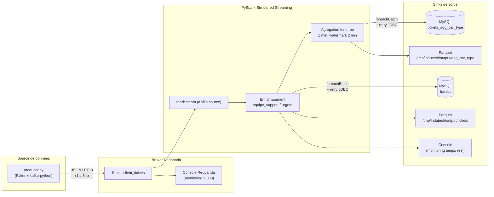

# Projet 9 — InduTech : POC de gestion de tickets en temps réel

POC d'un pipeline de streaming pour l'analyse en temps réel des tickets clients
d'InduTech. Les tickets sont générés par un producteur Python, envoyés dans un
broker **Redpanda** (compatible Kafka), puis consommés et enrichis par un job
**PySpark Structured Streaming** qui persiste les résultats dans **MySQL**
(avec une copie en Parquet pour l'analyse froide).

---

## Architecture du pipeline



## Démo vidéo

[](https://youtu.be/VIDEO_ID)

> Démo de ~5 min : démarrage du broker Redpanda, génération de tickets par
> le producer Python, consommation PySpark Structured Streaming et
> vérification des sorties Parquet. Le script détaillé est dans
> [VIDEO_SCRIPT.md](VIDEO_SCRIPT.md).

---

### Schema d'un ticket

| Champ        | Type      | Description                                             |
|--------------|-----------|---------------------------------------------------------|
| `ticket_id`  | String    | UUID unique du ticket                                   |
| `client_id`  | Int       | Identifiant client (1000–9999)                          |
| `created_at` | ISO8601   | Timestamp UTC de creation                               |
| `demande`    | String    | Texte de la demande (genere via Faker `fr_FR`)          |
| `type`       | String    | `technique` \| `facturation` \| `livraison` \| `autre`  |
| `priorite`   | String    | `basse` \| `moyenne` \| `haute`                         |

---

## Structure du projet

```
DE_Projet_9/
├── docker-compose.yml        # Orchestration Redpanda + Console + MySQL
├── requierements.txt         # Dependances Python communes
├── mysql/
│   └── init.sql              # Schema MySQL (tables tickets + agg)
├── producer/
│   ├── Dockerfile
│   └── producer.py           # Generateur de tickets
├── spark/
│   ├── Dockerfile
│   └── pyspark_consumer.py   # Job Structured Streaming
└── redpanda/
    └── Dockerfile
```

---

## Prerequis

- Docker & Docker Compose
- (Optionnel, pour execution locale hors Docker) Python 3.9+ et Java 11+

---

## Demarrage rapide

### 1. Lancer Redpanda + MySQL

```bash
docker compose up -d redpanda-0 console mysql
```

- Broker Kafka API : `localhost:19092` (externe) / `redpanda-0:9092` (interne)
- Console Redpanda : http://localhost:8080
- MySQL : `localhost:3306` (db `indutech`, user `indutech`/`indutech`)

Le schéma (`tickets`, `tickets_agg_par_type`) est créé automatiquement au
premier démarrage via [mysql/init.sql](mysql/init.sql).

### 2. Creer le topic (si non auto-cree)

```bash
docker exec -it redpanda-0 rpk topic create client_tickets
```

### 3. Lancer le producteur

**Via Docker** (recommande) :
```bash
docker build -f producer/Dockerfile -t indutech-producer .
docker run --rm --network redpanda-quickstart-one-broker_redpanda_network \
    -e KAFKA_BROKER=redpanda-0:9092 \
    indutech-producer
```

**En local** :
```bash
pip install -r requierements.txt
KAFKA_BROKER=localhost:19092 python producer/producer.py
```

### 4. Lancer le consommateur PySpark

**Via Docker** :
```bash
docker build -f spark/Dockerfile -t indutech-spark .
docker run --rm --network redpanda-quickstart-one-broker_redpanda_network \
    -e KAFKA_BROKER=redpanda-0:9092 \
    -v $(pwd)/output:/tmp/indutech/output \
    indutech-spark
```

**En local** :
```bash
spark-submit \
    --packages org.apache.spark:spark-sql-kafka-0-10_2.12:3.5.0,com.mysql:mysql-connector-j:8.4.0 \
    spark/pyspark_consumer.py
```

---

## Variables d'environnement

| Variable           | Defaut                     | Utilise par         |
|--------------------|----------------------------|---------------------|
| `KAFKA_BROKER`     | `localhost:19092` / `redpanda-0:9092` | producer + spark |
| `KAFKA_TOPIC`      | `client_tickets`           | producer + spark    |
| `OUTPUT_PATH`      | `/tmp/indutech/output`     | spark               |
| `CHECKPOINT_PATH`  | `/tmp/indutech/checkpoint` | spark               |
| `MYSQL_HOST`       | `mysql`                    | spark               |
| `MYSQL_PORT`       | `3306`                     | spark               |
| `MYSQL_DB`         | `indutech`                 | spark               |
| `MYSQL_USER`       | `indutech`                 | spark               |
| `MYSQL_PASSWORD`   | `indutech`                 | spark               |

---

## Logique metier (Spark)

- **Mapping equipe support** depuis le `type` :
  - `technique` → `Tech`
  - `facturation` → `Finance`
  - `livraison` → `Logistique`
  - autre → `General`
- **Flag `urgent`** : `True` si `priorite == "haute"`
- **Agregation fenetree** : nombre de tickets par `type` / `equipe_support`
  sur une fenetre glissante de 1 minute, watermark de 2 minutes.

### Résilience

- Écriture MySQL via `foreachBatch` + retry exponentiel (5 tentatives,
  backoff 2^n) pour absorber les déconnexions JDBC.
- **Checkpointing Spark** : en cas d'échec définitif, le micro-batch est
  rejoué automatiquement au redémarrage.
- `failOnDataLoss=false` et `maxOffsetsPerTrigger=1000` côté Kafka pour
  éviter les à-coups de charge.
- Option `rewriteBatchedStatements=true` dans l'URL JDBC pour accélérer
  les insertions en lot.

---

## Verification

Lister les messages dans le topic :
```bash
docker exec -it redpanda-0 rpk topic consume client_tickets --num 5
```

Interroger MySQL :
```bash
docker exec -it indutech-mysql mysql -uindutech -pindutech indutech \
    -e "SELECT type, equipe_support, COUNT(*) FROM tickets GROUP BY type, equipe_support;"

docker exec -it indutech-mysql mysql -uindutech -pindutech indutech \
    -e "SELECT * FROM tickets_agg_par_type ORDER BY window_start DESC LIMIT 10;"
```

Inspecter les fichiers Parquet produits :
```bash
ls output/tickets/
ls output/agg_par_type/
```

---

## Arret

```bash
docker compose down
```

Pour tout nettoyer (volumes + donnees) :
```bash
docker compose down -v
rm -rf output/
```
